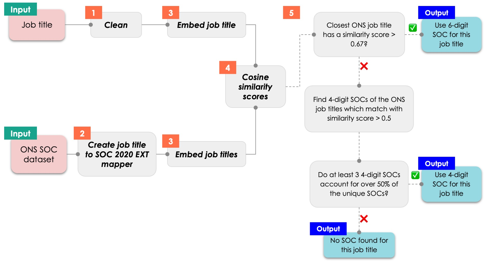

# SOCMapper

To create green measures at the occupation level we first need to map each job advert to a Standardised Occupation Category (SOC). The SOC dataset mapped to comes from the ONS website [here](https://www.ons.gov.uk/methodology/classificationsandstandards/standardoccupationalclassificationsoc/standardoccupationalclassificationsocextensionproject).

The `SOCMapper` class in `soc_map.py` maps job title(s) to SOC(s).

## Usage

```
from dap_prinz_green_jobs.pipeline.green_measures.occupations.soc_map import SOCMapper

soc_mapper = SOCMapper()
soc_mapper.load()
job_titles=["data scientist", "Assistant nurse", "Senior financial consultant - London"]

soc_mapper.get_soc(job_titles, return_soc_name=True)
```

## Output

The output for one job title is in the format

```
(((SOC 2020 Extension code, SOC 2020 Extension name), (SOC 2020 4-digit code, SOC 2020 4-digit name), SOC 2010 code), job title matched to in SOC data)
```

for example

```
((('2422/02', 'Financial advisors and planners'), ('2422', 'Fi
nance and investment analysts and advisers'), '3534'), 'financial consultant')
```

If the names of the SOC codes aren't needed then you can set `return_soc_name=False`. The variables `soc_mapper.soc_2020_6_dict` and `soc_mapper.soc_2020_4_dict` give the names of each SOC 2020 6 and 4 digit codes.

The following table gives the results of using the SOCMapper function on the job titles in the "Input job title" column.

| Input job title                      | SOC 2020 EXT code | SOC 2020 sub-unit group                   | SOC 2020 unit group                          | SOC 2010 code | SOC data job title   |
| ------------------------------------ | ----------------- | ----------------------------------------- | -------------------------------------------- | ------------- | -------------------- |
| data scientist                       | 2433/02           | Data scientists                           | Actuaries, economists and statisticians      | 2425          | data scientist       |
| Assistant nurse                      | 6131/99           | Nursing auxiliaries and assistants n.e.c. | Nursing auxiliaries and assistants           | 6141          | assistant nurse      |
| Senior financial consultant - London | 2422/02           | Financial advisors and planners           | Finance and investment analysts and advisers | 3534          | financial consultant |

## Methodology

The SOCMapper works by finding the semantically closest job titles between the inputed job titles and the job titles in the ONS SOC dataset. An overview of the methodology is in the diagram below.

<p align="center">
  
</p>

**Step 1:** We clean the inputted job advert. This cleaning involves removing words which describe the job conditions but not the job title; e.g. removing common placenames or words like "part-time".

For example, if our inputted job adverts were

```
["Data Scientist - London", "Electric motor assembler - part time", "Data visualisation developer £30k per annum"]
```

these would be cleaned to

```
['Data Scientist', 'Electric motor assembler', 'Data visualisation developer']
```

**Step 2:** We process the [ONS SOC dataset](https://www.ons.gov.uk/methodology/classificationsandstandards/standardoccupationalclassificationsoc/standardoccupationalclassificationsocextensionproject). An example of this dataset is:

| SOC 2010 | SOC 2020 | SOC 2020 Ext Code | INDEXOCC           | ADD       | IND         | INDEXOCC NATURAL WORD ORDER | SOC 2020 UNIT GROUP DESCRIPTIONS                   | SUB-UNIT GROUP DESCRIPTIONS                               |
| -------- | -------- | ----------------- | ------------------ | --------- | ----------- | --------------------------- | -------------------------------------------------- | --------------------------------------------------------- |
| 2425     | 2433     | 2433/02           | Scientist, data    |           |             | data scientist              | Actuaries, economists and statisticians            | Data scientists                                           |
| 2136     | 2134     | 2134/99           | Analyst, data      | computing |             | data analyst                | Programmers and software development professionals | Programmers and software development professionals n.e.c. |
| 3539     | 3544     | 3544/00           | Analyst, data      |           |             | data analyst                | Data analysts                                      | Data analysts                                             |
| 2136     | 2134     | 2134/03           | Developer, analyst |           |             | analyst developer           | Programmers and software development professionals | Software developers                                       |
| 8139     | 8149     | 8149/00           | Assembler, meter   |           |             | meter assembler             | Assemblers and routine operatives n.e.c.           | Assemblers and routine operatives n.e.c.                  |
| 8131     | 8141     | 8141/00           | Assembler, motor   | electric  |             | motor assembler             | Assemblers (electrical and electronic products)    | Assemblers (electrical and electronic products)           |
| 8132     | 8142     | 8142/02           | Assembler, motor   |           | engineering | motor assembler             | Assemblers (vehicles and metal goods)              | Vehicle and vehicle part assemblers                       |

We can combine the `INDEXOCC NATURAL WORD ORDER`, `ADD` and `IND` columns to create unique job titles. The dictionary of unique job titles to SOC information would be:

```
{"data scientist": ("2433/02", "2433", "2425"), "data analyst computing": ("2134/99", "2134", "2136"), "data analyst": ("3544/00", "3544", "3539"), "analyst developer": ("2134/03", "2134", "2136"), "meter assembler": ("8149/00", "8149", "8139"), "motor assembler electric": ("8141/00", "8141", "8131"), "motor assembler engineering": ("8142/02", "8142", "8132")}
```

**Step 3:** We embed these unique ONS job titles and the input job title using the `all-MiniLM-L6-v2` Sentence Tranformers pretrained model.

**Step 4:** We then calculate the cosine similarity between the embedded input job title and all the embedded ONS job titles.

In our example, the cosine similarity scores for each input job title (row) and each ONS SOC data job title (columns) are:

|                              | data scientist | data analyst computing | data analyst | analyst developer | meter assembler | motor assembler electric | motor assembler engineering |
| ---------------------------- | -------------- | ---------------------- | ------------ | ----------------- | --------------- | ------------------------ | --------------------------- |
| Data Scientist               | **1.0**        | 0.69                   | 0.81         | 0.56              | 0.20            | 0.07                     | 0.15                        |
| Electric motor assembler     | 0.07           | 0.20                   | 0.11         | 0.15              | 0.52            | **0.81**                 | 0.80                        |
| Data visualisation developer | 0.53           | 0.57                   | 0.59         | 0.47              | 0.22            | 0.04                     | 0.17                        |

**Step 5:** Finally, we find the SOC information for the ONS job title with the highest similarity as long as it is over a certain threshold (default is 0.67). If there is no single job title with a particularly high similiarity, then we use a consensus approach at the SOC 2020 4-digit level (default to having over 3 matches with over 0.5 similarity score).

With the default values, the final matches for each inputted job title would be:

|                              | ONS job title matched to | SOC     | SOC description                                 |
| ---------------------------- | ------------------------ | ------- | ----------------------------------------------- |
| Data Scientist               | data scientist           | 2433/02 | Data scientists                                 |
| Electric motor assembler     | motor assembler electric | 8141/00 | Assemblers (electrical and electronic products) |
| Data visualisation developer | None                     | None    | None                                            |

However, if we had set slightly different conditions for the consensus approach, another outcome could be that the "Data visualisation developer" job title was mapped to the SOC "2134 - Programmers and software professionals" since 2 out of the 4 matches with over 0.45 similarity were from this 4-digit SOC.

# Occupational Green Measures

The script

```
dap_prinz_green_jobs/pipeline/green_measures/occupations/occupation_measures_utils.py
```

contains functions needed to see whether occupations are green or not.

## Datasets used

- `indexsocextv5updated.xlsx`: A dataset of the SOC codes for each job title can be found on the ONS website [here](https://www.ons.gov.uk/methodology/classificationsandstandards/standardoccupationalclassificationsoc/standardoccupationalclassificationsocextensionproject). A download of the "SOC 2020 6-digit index (2.7 MB xlsx)" downloaded as of 25/04/23 was uploaded to S3 (`s3://prinz-green-jobs/inputs/data/occupation_data/ons/indexsocextv5updated.xlsx`).
- `Summary of green occupations (Nov 2021).xlsx`: The Greater London Authority have mapped the [ONET green occupations codes](https://www.onetcenter.org/green/skills.html) to UK SOC. This data is available to download [here](https://data.london.gov.uk/dataset/identifying-green-occupations-in-london?_gl=1%2a8t5yr7%2a_ga%2aNzIwMzA5OTAwLjE2ODE5NzgzODk.%2a_ga_PY4SWZN1RJ%2aMTY4MjQzNTQxNS4xLjAuMTY4MjQzNTQyMC41NS4wLjA.) and a description about its creation is [here](https://www.london.gov.uk/business-and-economy-publications/identifying-green-occupations-london#useful-links). A download of the "Summary of green occupations (Nov 2021).xlsx" downloaded as of 25/04/23 was uploaded to S3 (`s3://prinz-green-jobs/inputs/data/occupation_data/gla/Summary of green occupations (Nov 2021).xlsx`).
- `greentimesharesoc.xlsx`: A dataset of the green time shares for each SOC code. The data is available to download [here](https://www.ons.gov.uk/economy/environmentalaccounts/datasets/estimatedtimespentongreentasksbyoccupationcode) with methodology [here](https://www.ons.gov.uk/economy/environmentalaccounts/articles/developingamethodformeasuringtimespentongreentasks/march2022). A download of it was downloaded on 23/05/23 and uploaded to S3 [here](s3://prinz-green-jobs/inputs/data/occupation_data/ons/greentimesharesoc.xlsx).
- `Occupations_for_all_green_topics.csv`: The O\*NET green topics per occupation dataset downloaded from [here](https://www.onetonline.org/search/green_topics/) on 07/07/23. The report describing this data can be found [here](https://www.onetcenter.org/reports/Green_Topics.html).

## Green measures

Measures based off the job adverts predicted 2010 SOC:

- GREEN CATEGORY : The green category ("Green Enhanced Skills", "Green Increased Demand", "Green New & Emerging", "Non-Green") from the GLA dataset - These were found via "a mapping exercise between US (O\*NET) and UK (SOC 2010) occupational taxonomies using a crosswalk derived from the LMI for All API. This exercise involves a degree of judgement and the list of green occupations remains subject to development." From `Summary of green occupations (Nov 2021).xlsx`.
- GREEN/NOT GREEN : Green or non-green categories from the GLA data, again based off O\*NET's 2011 work. From `Summary of green occupations (Nov 2021).xlsx`.
- GREEN TIMESHARE : Estimates of the fraction of time spent doing green tasks (using O\*NET 2011 green task definitions). From `greentimesharesoc.xlsx`.
- GREEN TOPICS : O\*NET's 2022 work on green topics linked to US occupations. From `Occupations_for_all_green_topics.csv`.

## Usage

```
from dap_prinz_green_jobs.pipeline.green_measures.occupations.occupations_measures_utils import OccupationMeasures

om = OccupationMeasures()
om.load()
unique_job_titles = ["Data Scientist", "Nurse", "Key Stage 4 teacher", "Pharmacist", "Biologist"]
job_title_2_match = om.precalculate_soc_mapper(unique_job_titles)

om.get_green_measure_for_job_title("Data Scientist")
>>> {'GREEN CATEGORY': 'Non-Green', 'GREEN/NOT GREEN': 'Non-green', 'GREEN TIMESHARE': 12.9, 'GREEN TOPICS': 21, 'SOC': {'SOC_2020_EXT': '2433/02', 'SOC_2020': '2433', 'SOC_2010': '2114'}}

or

om.get_measures(job_adverts= [{'description': 'We are looking for a sales ...', 'job_title': 'Data Scientist'}], job_title_key='job_title')
>>> [{'GREEN CATEGORY': 'Non-Green', 'GREEN/NOT GREEN': 'Non-green', 'GREEN TIMESHARE': 12.9, 'GREEN TOPICS': 21, 'SOC': {'SOC_2020_EXT': '2433/02', 'SOC_2020': '2433', 'SOC_2010': '2114'}}]

```
