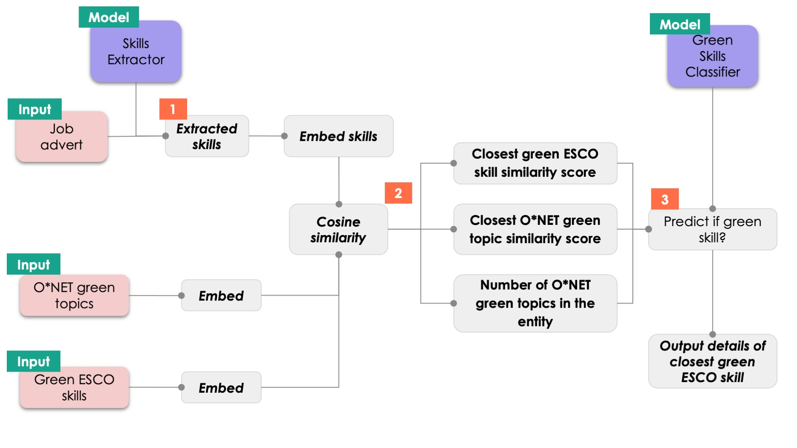

# 🧑‍🔧🥬 Green Skills

This directory contains the scripts needed to extract green skills for a given job advert. This directory is organised as follows:

1. [skills_measures_utils.py](https://github.com/nestauk/dap_prinz_green_jobs/tree/dev/dap_prinz_green_jobs/pipeline/green_measures/skills/skills_measures_utils.py): The script which contains the `SkillMeasures` class to find green skills in job adverts. This utilises our [Skills Extractor library](https://github.com/nestauk/ojd_daps_skills) to extract and map skills onto a structured green skills list.
2. [green_skill_classifier.py](https://github.com/nestauk/dap_prinz_green_jobs/tree/dev/dap_prinz_green_jobs/pipeline/green_measures/skills/green_skill_classifier.py): A script to train and use a model to predict whether a skill is green or not.
3. [evaluation/](https://github.com/nestauk/dap_prinz_green_jobs/tree/dev/dap_prinz_green_jobs/pipeline/green_measures/skills/evaluation/): A directory with the evaluation of how well the `SkillMeasures` class extracts and maps skills.

It also contains the following `.py` files:

1. [green_esco_formatting.py](https://github.com/nestauk/dap_prinz_green_jobs/tree/dev/dap_prinz_green_jobs/pipeline/green_measures/skills/green_esco_formatting.py): A script to format the ESCO green skills taxonomy into a structure compatible with the Skills Extractor library. This needs to be run as a one-off.
2. [map_skills_utils.py](https://github.com/nestauk/dap_prinz_green_jobs/tree/dev/dap_prinz_green_jobs/pipeline/green_measures/skills/map_skills_utils.py): Utils to match skill embeddings to all of the ESCO taxonomy. The majority of this code is from the [ojd_daps_skills](https://github.com/nestauk/ojd_daps_skills) repo, but replicated here since currently there was no functionality in `ojd_daps_skills` to take in already embedded skills and map them.
3. [customise_skills_extractor.py](https://github.com/nestauk/dap_prinz_green_jobs/tree/dev/dap_prinz_green_jobs/pipeline/green_measures/skills/customise_skills_extractor.py): To add the custom config file, formatted skills taxonomy and taxonomy embeddings to the relevant location in the `ojd-daps-skills` library location run this script with the `--config_name "extract_green_skills_esco"` argument. NOTE: it isn't neccessary to run this anymore, as such this file is unneeded.

## 🔨 `SkillMeasures` core functionality

Note: predicting skill entities and embedding them for comparison with the green skills taxonomy can take a long time if you are inputting many job adverts.

```python

from dap_prinz_green_jobs.pipeline.green_measures.skills.skill_measures_utils import (
    SkillMeasures,
)
sm = SkillMeasures(config_name="extract_green_skills_esco")
sm.initiate_extract_skills(local=False, verbose=True)

job_adverts = [
    {"id": "a", "job_text": "This job requires communication and Excel skills. We want someone with experience in sustainability. Heat pump installation skills would be useful. We have a pension scheme benefit."},
    {"id": "b", "job_text": "This job contains no skills."},
    {"id": 55, "job_text": "This job contains Excel skills. Benefits include; generous pension scheme and cycle to work scheme."},
    {"id": 2, "job_text": "This job contains a really long sentence. Promote good practice of material sustainability (reuse and or recycle) initiatives to reduce waste and save costs."},
    ]

# We will load the green taxonomy embeddings from S3 since they have already been calculated
taxonomy_skills_embeddings_dict = sm.get_green_taxonomy_embeddings(
    output_path="outputs/data/green_skill_lists/green_esco_embeddings_20230815.json", load=True)

green_skills = sm.get_measures(job_adverts)

```

## 📤 Output

The output for one job advert is in a dictionary format

```
{
    'NUM_ORIG_ENTS': Number of entities in the job advert text,
    'NUM_SPLIT_ENTS': Number of entities in the job advert text when longer entities are split up,
    'ENTS': [([Entity text], Entity type), ...],
    'GREEN_ENTS': [(Green entity text, ('green', green skill prediction probability, (Green ESCO skill mapped to, Green ESCO skill ID mapped to, Similarity score of mapping)))],
    'PROP_GREEN': len(GREEN_ENTS)/NUM_SPLIT_ENTS,
    'BENEFITS': A list of benefits extracted from this job advert
}
```

Where entities are parts of the job advert text identified to be one of 3 entity types; Skill, Multiskill or Experience.

For example

```
{'NUM_ORIG_ENTS': 4, 'NUM_SPLIT_ENTS': 4, 'ENTS': [(['communication'], 'SKILL'), ...], 'GREEN_ENTS': [('Heat pump installation skills', ('green', 0.7191159533073931, ('heat pump installation', '00735755-adc6-4ea0-b034-b8caff339c9f', 0.9072619656040537))), ...], 'PROP_GREEN': 0.5, 'BENEFITS': None}
```

The following table gives the full results from the example.

| Job ID | NUM_ORIG_ENTS | NUM_SPLIT_ENTS | PROP_GREEN | BENEFITS                                   | ENTS                                                                                                                                                                                                               | GREEN_ENTS                                                              | Green skill classifier score | Green ESCO map                                           |
| ------ | ------------- | -------------- | ---------- | ------------------------------------------ | ------------------------------------------------------------------------------------------------------------------------------------------------------------------------------------------------------------------ | ----------------------------------------------------------------------- | ---------------------------- | -------------------------------------------------------- |
| a      | 4             | 4              | 0.5        | ['pension scheme']                         | (['communication'], 'SKILL')                                                                                                                                                                                       |                                                                         |                              |                                                          |
|        |               |                |            |                                            | (['Excel'], 'SKILL')                                                                                                                                                                                               |                                                                         |                              |                                                          |
|        |               |                |            |                                            | (['Heat pump installation skills'], 'SKILL')                                                                                                                                                                       | Heat pump installation skills                                           | 0.72                         | ('heat pump installation', '0073..', 0.91)               |
|        |               |                |            |                                            | (['experience in sustainability'], 'EXPERIENCE')                                                                                                                                                                   | experience in sustainability                                            | 0.99                         | ('sustainability', 'b1b1..', 0.76)                       |
| b      | 0             | 0              | 0          |                                            |                                                                                                                                                                                                                    |                                                                         |                              |                                                          |
| 55     | 1             | 1              | 0          | ['pension scheme', 'cycle to work scheme'] | (['Excel'], 'SKILL')                                                                                                                                                                                               |                                                                         |                              |                                                          |
| 2      | 1             | 3              | 1          |                                            | (['Promote good practice of material sustainability (reuse and or recycle)', 'sustainability (reuse and or recycle) initiatives to reduce waste and', 'initiatives to reduce waste and save costs'], 'MULTISKILL') | Promote good practice of material sustainability (reuse and or recycle) | 0.98                         | ('promote sustainability', '469e..', 0.71)               |
|        |               |                |            |                                            |                                                                                                                                                                                                                    | sustainability (reuse and or recycle) initiatives to reduce waste and   | 1                            | ('analyse  new recycling opportunities', '89f5..', 0.77) |
|        |               |                |            |                                            |                                                                                                                                                                                                                    | initiatives to reduce waste and save costs                              | 0.83                         | ('managing waste', '40f6..', 0.79)                       |

## 🖊️ Methodology

An overview of the methodology to extract green skills from a job advert is in the diagram below.

<p align="center">
  
</p>

**Step 1:** Skills are extracted from the job advert by applying the trained skills extractor model. Skill entities over 10 words long are split up into separate entities.

**Step 2:** The skills extracted, all the green ESCO skills and the all the O\*NET green topics are embedded using the `all-MiniLM-L6-v2` Sentence Tranformers pretrained model. The cosine similarity scores are then calculated, allowing us to find the closest green ESCO skill, the closest O\*NET green topic, and the number of O\*NET green topics exactly found in the entity (exact word matching).

**Step 3:** A trained green skill classifier model is then applied using the features found from the previous step. This predicts whether the skill entity is green or not. If the skill is green, then the details of the closest green ESCO skill are outputted.

### 🏋️ Training a Green Skills Classifier

Core to `SkillMeasures` is the predicting whether a skill entity is likely to be green or not, this is done by training a random forest classifier. The green skills classifier can be trained by running:

```
python dap_prinz_green_jobs/pipeline/green_measures/skills/green_skill_classifier.py
```

The training data for this is `s3://prinz-green-jobs/inputs/data/training_data/green_skill_training_data.csv` - this was created by labelling a dataset of frequently occurring skills, as well as skills which are mapped to ESCO green skills with a high similarity score.

This dataset contains 971 skills labelled as not-green and 743 labelled as green.

The random forest classifier uses three features:

1. The cosine similarity score between the embedded entity and the closest ESCO green skill embedding.
2. The cosine similarity score between the embedded entity and the closest O\*NET green topics embedding.
3. The number of O\*NET green topics were found in the entity (using exact word matching).

### 🔨 Green Skills Classifier Usage

This trained model can be loaded and used by running:

```python
from dap_prinz_green_jobs.pipeline.green_measures.skills.green_skill_classifier import GreenSkillClassifier

green_skills_classifier = GreenSkillClassifier()
green_skills_classifier.load_esco_data()
green_skills_classifier.load(
    model_file="s3://prinz-green-jobs/outputs/models/green_skill_classifier/green_skill_classifier_20230906.joblib"
)

pred_green_skill = green_skills_classifier.predict(
    ["Excel skills", "Heat pump installation skills"]
)

>>> [('not_green', 1.0, ('carry out sample analysis', '82423b5c-486f-42e7-b00e-7358757a8de5', 0.23)), ('green', 0.72, ('heat pump installation', '00735755-adc6-4ea0-b034-b8caff339c9f', 0.91))]

```

As you can see, the closest green ESCO skill will always be outputted, even if the skill have been predicted as "not_green".

### 🥇 Green Skills Classifier Results

The most recently saved model `s3://prinz-green-jobs/outputs/models/green_skill_classifier/green_skill_classifier_20230906.joblib` has the following test metrics:

```
              precision    recall  f1-score   support

       green       0.90      0.86      0.88       175
   not_green       0.91      0.94      0.92       254

    accuracy                           0.91       429
   macro avg       0.91      0.90      0.90       429
weighted avg       0.91      0.91      0.91       429

```

## 💾 Datasets used & green measures

- `greenSkillsCollection_en.csv`: A dataset of ESCO's green skills as downloaded on the 24th April 2023. This is stored on S3 [here](`s3://prinz-green-jobs/inputs/data/green_skill_lists/esco/greenSkillsCollection_en.csv`).
- `esco_data_formatted.csv`: The formatted version of ESCO's full skills taxonomy as downloaded from July 2022. This was formatted by running [this script from the ojd_daps_skills repo](https://github.com/nestauk/ojd_daps_skills/blob/dev/ojd_daps_skills/pipeline/skill_ner_mapping/esco_formatting.py).
- `Occupations_for_all_green_topics.csv`: The O\*NET green topics per occupation dataset downloaded from [here](https://www.onetonline.org/search/green_topics/) on 07/07/23. The report describing this data can be found [here](https://www.onetcenter.org/reports/Green_Topics.html).

Green measures based of the skills in job adverts are as follows:

- **PROP_GREEN:** The proportion of entities which were mapped to green skills (len(GREEN_ENTS)/NUM_SPLIT_ENTS)
